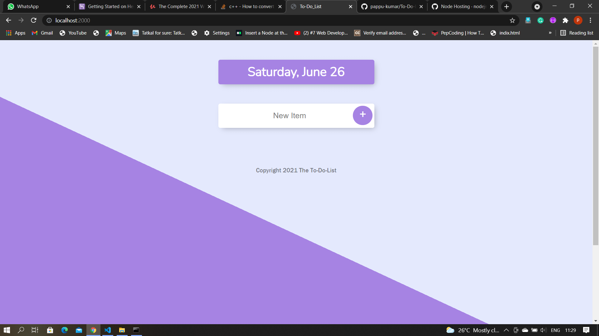
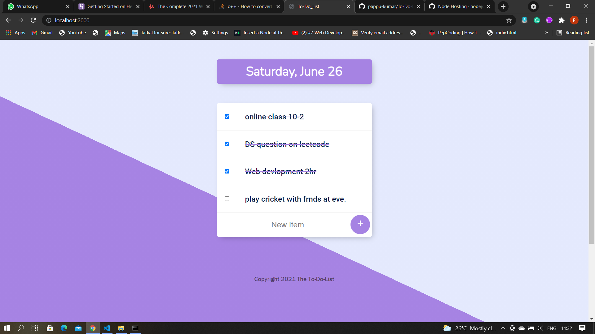

<h1> #TO_DO_LIST </h1>

In this To-Do-List we can read write our works and auto delete the work when will come to the next day.
Every Day you will get an empty list just write your work and get track of your work whole Day!

<h2> ###EMPTY_LSIT: </h2

This is an empty lsit you can write your work on new item and click on + icon, now your first work has written

  <h2> ###WORK_ADDED: </h2>

After adding an item in To-Do--List we can read our work, and also apear a check box with the text.

<h2> ###WORK_DONE: </h2>

After finishing the work when we click on check box, one horizintal line apper above the text item. To indicated that work has done...!  

